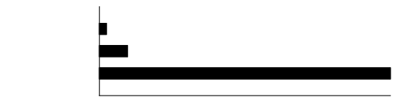

<center>

<em>An extremely tiny and fast alternative to MkDocs</em>
</center>

## Features

- Is installed as a single (tiny) binary. No dependencies!
- Generates static HTML that is _tiny_ and [can be free from JavaScript](about/no-javascript.md).
- Supports [Markdown extensions](about/markdown-extensions.md) like footnotes, admonitions, and more.

```
❯ hyperfine --prepare 'cargo install --path .' -w3 'picodocs build' 'mkdocs build' --export-csv benchmark.csv
Benchmark 1: picodocs build
  Time (mean ± σ):      11.5 ms ±   0.7 ms    [User: 2.6 ms, System: 12.7 ms]
  Range (min … max):    10.1 ms …  12.6 ms    10 runs

Benchmark 2: mkdocs build
  Time (mean ± σ):     115.9 ms ±   1.7 ms    [User: 104.1 ms, System: 12.3 ms]
  Range (min … max):   112.7 ms … 117.6 ms    10 runs

Summary
  picodocs build ran
   10.07 ± 0.65 times faster than mkdocs build
```


